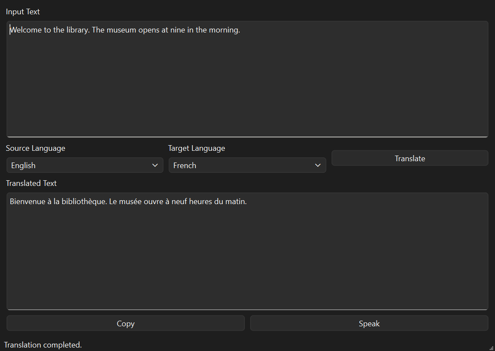
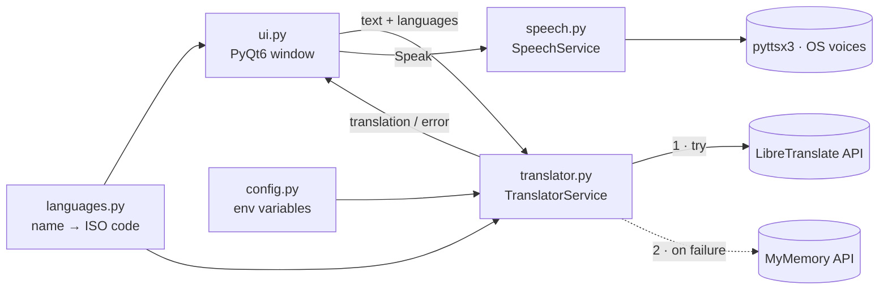

# 🌐 Language Translation Tool



> **A lightweight desktop translator that keeps working when a free translation API goes down — and reads the result aloud.**


## What it does

A PyQt6 desktop app for translating text between **English, Arabic and French**.

- **Provider fallback** — tries a LibreTranslate server first and automatically falls back to the MyMemory API if it fails, so one outage doesn't break the app.
- **Text-to-speech** — the *Speak* button reads the translation aloud with an offline voice (pyttsx3), picking an installed voice that matches the target language.
- **Copy to clipboard** in one click.
- **Friendly error handling** — empty input, over-long input (2,000-char limit), network failures and missing voices all show a clear message instead of crashing.
- **Configurable** — provider URLs and an optional API key come from environment variables, never hard-coded.

## Tech stack

| Area | Tools |
|---|---|
| Language | Python 3.10+ |
| GUI | PyQt6 |
| HTTP / APIs | requests · LibreTranslate API · MyMemory API |
| Text-to-speech | pyttsx3 (offline, uses OS voices) |

## How to run

```bash
git clone https://github.com/AhmedAbdlwhd/language-translation-tool.git
cd language-translation-tool

python -m venv .venv
# Windows
.venv\Scripts\activate
# macOS / Linux
source .venv/bin/activate

pip install -r requirements.txt
python main.py
```

### Environment variables (optional)

Defaults are set in `config.py`; override them to use your own provider.

| Variable | Purpose |
|---|---|
| `LIBRETRANSLATE_URL` | LibreTranslate-compatible `/translate` endpoint (primary) |
| `LIBRETRANSLATE_API_KEY` | API key, if your LibreTranslate instance requires one |
| `MYMEMORY_URL` | MyMemory endpoint (fallback) |

```powershell
# PowerShell example — point at a self-hosted LibreTranslate
$env:LIBRETRANSLATE_URL = "http://localhost:5000/translate"
```

## Architecture



```
.
├── main.py          # app entry point
├── ui.py            # PyQt6 window, widgets, event handlers
├── translator.py    # translation service with provider fallback
├── speech.py        # text-to-speech service
├── languages.py     # language name → ISO code mapping
└── config.py        # environment-based provider configuration
```

The UI never talks to an API directly — it calls service classes, so providers or the TTS engine can be swapped without touching the interface.

## What I learned

- **Design for unreliable dependencies.** Free public APIs rate-limit and go offline; a fallback chain keeps the app usable when one provider fails.
- **Validate API responses, don't just trust them.** MyMemory is crowd-sourced and sometimes returns an empty top result — I now fall back to the next-best match instead of showing a blank box.
- **Separating UI from logic.** Keeping translation and speech in service classes kept `ui.py` focused on widgets and events.
- **Configuration belongs outside the code.** Reading URLs and keys from environment variables means no secrets end up in the repo.

## Troubleshooting

- **Translation fails** — check your internet connection and try again; free providers can be rate-limited or temporarily unavailable.
- **Speak only works for English** — install the Arabic/French speech voices in Windows: *Settings → Time & Language → Language & Region → Language options → Speech*.
- **Nothing copied** — make sure the translation succeeded and output text is visible before clicking *Copy*.

## Known limitations

- The default public LibreTranslate server (`translate.argosopentech.com`) is currently offline, so translations are served by the MyMemory fallback. Set `LIBRETRANSLATE_URL` to a working instance to use LibreTranslate.
- Free endpoints have rate limits; MyMemory's crowd-sourced results can occasionally be imperfect.
- Voice quality and availability depend on the voices installed on your OS.

## Roadmap

- [ ] Run translation on a worker thread so the UI never freezes on slow networks
- [ ] Unit tests for the translator and speech services
- [ ] Provider selector in a settings dialog
- [ ] Package as a standalone executable (PyInstaller)

---

Built as part of the **CodeAlpha** AI internship. Licensed under the [MIT License](LICENSE).
